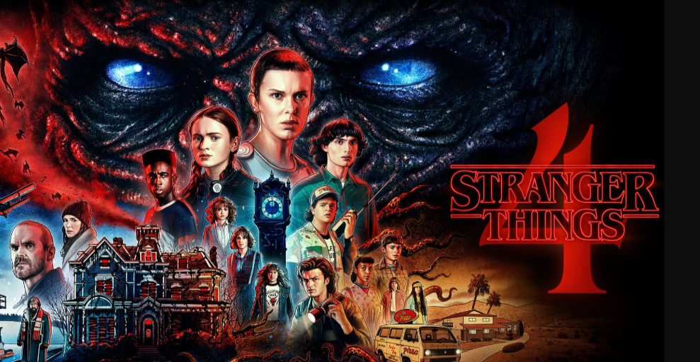
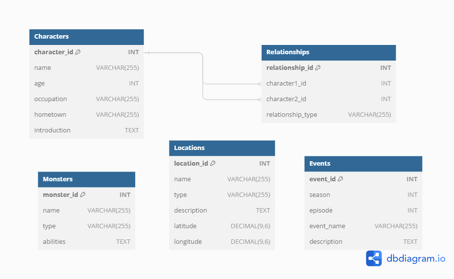
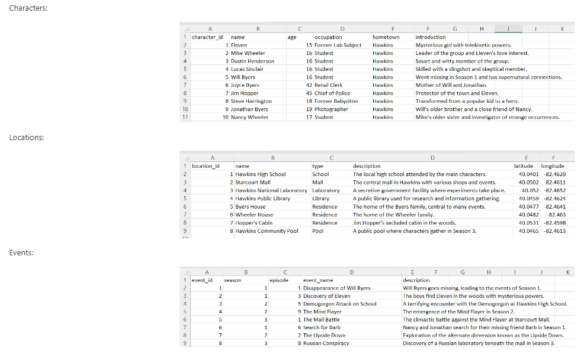
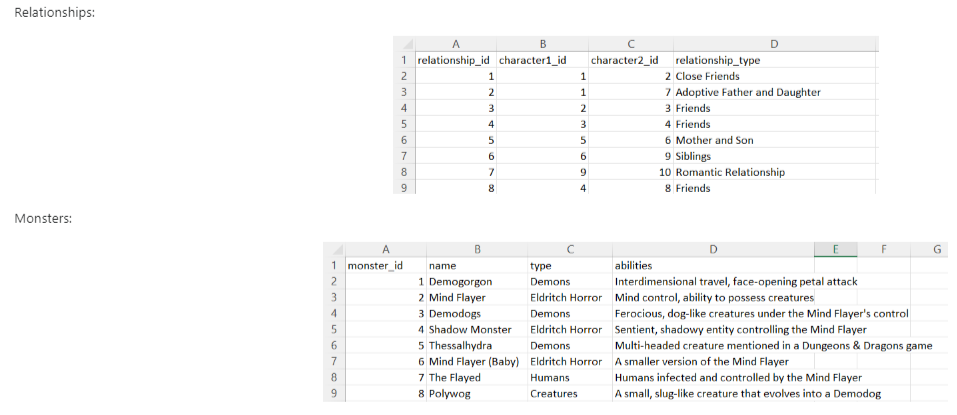

# Challenge 1 - Stranger Things

## Entity Relationship Diagram

## Tables

## Questions

1. Retrieve the names of the characters?
2. Find characters with age greater than 18?
3. Find events in Season 2?
4. Get details of the 'Mind Flayer' monster?
5. Retrieve characters and their associated events?
6. Calculate the total number of characters from each hometown?
7. Retrieve characters who were involved in events in Season 1 or Season 2?
8. Find the top 3 oldest characters?
9. Find the average age of characters in Hawkins?
10. Rank characters by age in descending order?
    
Access solutions to the challenge [Here](./Challenge_1.sql)
