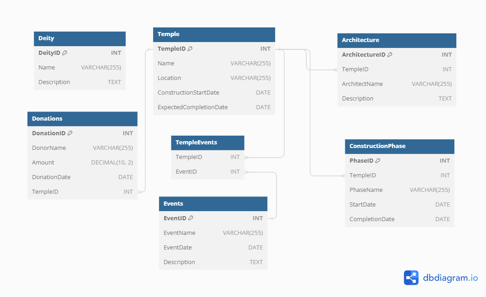

# Challenge 3 - Ayodhya Ram Temple SQL Analysis

## Entity Relationship Diagram

## Questions

1) Retrieve information about the Ram Mandir?
2) List all construction phases for the Ram Mandir?
3) Find the total amount of donations received for the Ram Mandir?
4) Get details about the architecture of the Ram Mandir?
5) Retrieve events associated with the Ram Mandir?
6) Find donors who contributed more than 50000 towards the Ram Mandir?
7) Retrieve details about a specific deity (e.g., Rama) ?
8) Find the start and end dates of the construction phases for the Ram Mandir?
9) Count the number of events associated with each temple?
10) ind the donors who made contributions on or after 2021-06-01'?
    
Access solutions to the challenge [Here](./Challenge_3.sql)
