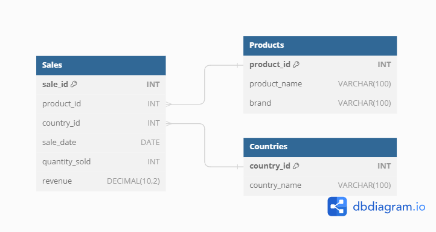

# Challenge 4 - Valentine's Day Chocolate Sales

## Entity Relationship Diagram

## Questions

1) Find the product with the highest average revenue per sale?
2) Find the product with the highest total revenue?
3) Determine the month with the highest total revenue across all sales?
    
Access solutions to the challenge [Here](./Challenge_4.sql)
